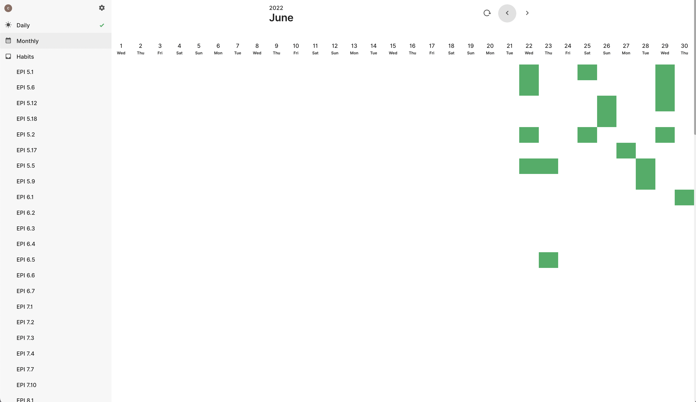

# Tech Interview

## Resources:

- [EPI-to-LC](https://github.com/slgriff/EPI-to-LC)

- [Edbert](https://tinyurl.com/4hdj47mv)

## Other

- [Karpathy's advice for preparing for exam in school](https://cs.stanford.edu/people/karpathy/advice.html)
- [Scott Young](https://www.scotthyoung.com/blog/articles/)
- [Cal Newport](https://www.calnewport.com/blog/) [and his advice to people who want to become software engineers with little background.](https://youtu.be/uS5jlG16zKs)
- [Peak by Anders Ericsson and Robert Pool](https://www.amazon.com/Peak-Secrets-New-Science-Expertise/dp/0544947223/ref=tmm_pap_swatch_0?_encoding=UTF8&qid=&sr=)
- [Andrew Huberman on learning](https://youtu.be/xJ0IBzCjEPk)

## Updates/notes:

## 7/12/22
 
 - In the EPI, I decided to do the problems recommended in the Scenario 1 (The first problem for each chapter typically) and read the introduction for each chapters. This way, I can get coverage for all the materials and for form overall big picture idea and connections between topics.

## 7/11/22

- Merged journal with this readme.

## 7/6/22

- Since I am entirely new on the topic of Linked List, lot of my time was reading and trying to understand the solutions from EPI, Neetcode, or Grokking (EPI is most of the time fine).
- I've been writing the solution code of blank paper and study it line-by-line and try to write it again without looking.
  - This method was influenced by Benjamin Franklin's approach to learning how to write; where he copied somebody else's writing and actively recall it.

## 7/5/22

- Started using habitory to track problems I did.
- Started Grokking.

- Bought Grokking, this will be the last time I spend money on interview prep.

## 7/2/22

- Went over all the problems in chapter 6 except for 6.7.
- Had the general sense or idea of the solution but could not execute on the code to get it right.
- There are a number of methods used in the textbook that I need to learn. (functools, reduce, hexdigits, lambda, ...)

## 7/1/22

- Took a break.

## 6/30/22

- Writing codes on paper is overkill, just design algorithm on paper then code on keyboard.

- Changed trello. Auto-regulating on a scale of 1-3 (😊, 🤨, and 🙁 emoji).
- If I get the design wrong, move the card to 🙁.
- If I get the design idea on the right track but got the code wrong, move the card to 🙁 because that actually means my design was all over the place or vague.
- If I'm happy with what I got, move card to 😊.
- Read the evaluation I wrote and reattempt problems on 🙁 and 🤨 around 2-3 days (if I remember the solution, just read the evaluation). Do not read the evaluation for 😊 problem cards and reattempt once every week.
- Put problem cards in zero pass if I want to go over it again.
- Don't move on to next chapter until I get at least 75% of the problems design correct.
- Don't write code on paper, only design.
- Follow the question.md

## 6/29/22

- Went over all the problems in chapter 5 I've done so far.
- The ideas were correct but was inadequate in the actual coding and sometimes pseudocode.

## 6/28/22

- Dear diary, I got the wrong solution to EPI 5.5 again. Sned help.

## 6/27/22

- Looked over problems I did and did some research for my next project (edgar-fin-api). It seems that this project might take more time than I initially thought, so I'm not gonna do it.
- Added problem set containing only the problems in EPI.

## 6/26/22

- [Time track](https://docs.google.com/spreadsheets/d/1Jy4TRW5geWFlUVqOwCHh32BZSAPPkbB3LgF2NXbsoaQ/edit?usp=sharing)

## 6/25/22

- Added directory for scans of problems I worked through on paper.
- Started journal.

## 6/24/22

- Added Edbert Chan's "Welcome To The Coding Interview - You Suck"

## 6/23/22

- Started doing something similar to the [Leitner system](https://www.mindedge.com/learning-science/the-leitner-system-how-does-it-work/),
- reduced resources used (still using leetcode discussion when available),
- merged the EPIJudge(only Python files) fork with this repo, and
- started doing only the easy problems on EPI per chapter. Will come back for the medium/hard problems after going through all the chapters.

### My setup:

